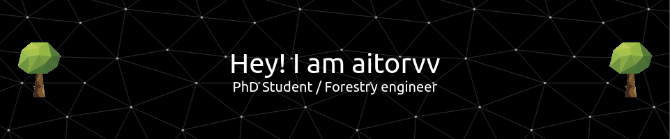

👀 I like to learn new and diverse things all the time.

:floppy_disk: I really enjoy playing with data and coding.

📚 I’m actually PhD student, that's the title of my topic: *Analysis of forest dynamics in a context of global change using Artificial Intelligence*.

🌳 I'm a real fan of [SIMANFOR](https://www.simanfor.es/), a forest growth simulator, and I love to implement new models and teach [how it works](https://github.com/simanfor)

:speaking_head: I´m also lecturing at [Forestry](https://www.uva.es/export/sites/uva/2.estudios/2.03.grados/2.02.01.oferta/estudio/e73e882d-72fd-11ec-ae63-00505682371a/) degree, [DATAFOREST](https://www.uva.es/export/sites/uva/2.estudios/2.04.master/2.03.01.oferta/estudio/Master-en-Gestion-Forestal-basada-en-Ciencia-de-Datos-00002/) MSc degree, and at [GEODATA](https://github.com/GEODATA-UVa) microcredential at University of Valladolid.

:computer: Here some of my GitHub stats:

 

<!---

--->

📫 You can contact me at aitor.vazquez.veloso@uva.es

:sparkles: More about me:
 
 
 
[![iuFOR](data:image/png;base64,iVBORw0KGgoAAAANSUhEUgAAABgAAAAgCAMAAAA/gEgKAAABL1BMVEX////v8POws7qoq7LKzNCmqK9tUgCuhwC2jQCMbABJQzTU1dnz8vOsrbDOowD/yyv+xiv2wyReTADh4uV7d3sAAAAMAAzn6vL4wCpcW1sliCFRwE5BoT45PDjwuw/suSrHoiWDZxdce1pNtkpPu0wzmTDAuMCVl5p1Xh49Lxeqih02gzJPc07TqSIAABIeHAiEbzAvXSwjXCNMPB0APSQyLhVfRQBPSU04eDYbHhXW1tYgPx5GoUQ1Ixg1LBssIQFENA6GjIhpgmhGMR99ZAAxay84QCU/LBB6eHJ4qnaPio8AVAAvUCdznHLq6uqhn51LxUc1GwsOHRFocmcVOxIVLBMqGyQMSgsnAA1lYGWouKcnTCcUDgAwLy4/jz329vZFREQALABMZElYV1MsLCwmubCHAAABkElEQVR4AaWShWKDMBRFM7fq6OskdEbq7m7zre7u/f9vGBKY+8XveQYE/Usrq2vrH/kbm1vbO7t7Ly2VcFJrtDqdVr/PPPsGMDLoYFt3KEh7pPjqY8ya0MaJ6J+ena/I4AJzxGyxikBrszuUWk7Ccdhl1Zye6rVuj9enlPKzmOAAeIOhcCQai0OC+haAZCqZzsSzuUCef8jK3S9x0ghXdnvQdG2y3ODbu3sKHghhY1dBe1bNPBYwKSqghDmcgngmW0aVKiHOmgwMKaM/nK4DX7rRdBLSalNQBmjxle7ySN3p+qsYO3uU9Ks4k7HnKshfjcGgOCiCVQIVPh2G/PgxgmNXvLIVCawf8xmjhPBtyPjKnhaDREXNt3fCW1k5jk0nnZmgnKLqwVGZvzIdzMENAIz4J1ptIv0AmFYMTFmFFCUSNFeVSKj4IEWGR3rT6/hnLxYEUwBa1XJDKi8S5qzziNaqB174lcWiIX+5IzmBNlcarqpegdUEP6QImcQroJ4uostlfLmcLtfRe014ldF3egKpMkKaxxFR6QAAAABJRU5ErkJggg==)](http://sostenible.palencia.uva.es/users/aitorvv)
 
 
 

<!---
aitorvv/aitorvv is a ✨ special ✨ repository because its `README.md` (this file) appears on your GitHub profile.
You can click the Preview link to take a look at your changes.
--->
