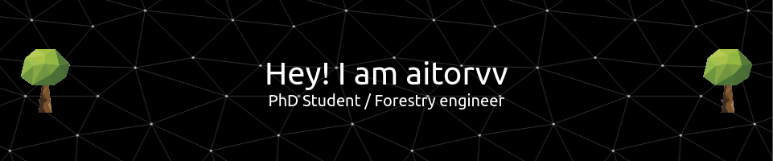
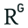

<!---

--->

  
# 🌲 Hey! I am **Aitor** 🌳

### 🎓 PhD Student | 🌱 Forestry Engineer | 💻 Data and programming lover

<!---

--->

---

#### 👀 I like to learn new things all the time.

#### :floppy_disk: I enjoy playing with data and coding.

#### 📚 I am currently a [PhD student at the University of Valladolid](https://portaldelaciencia.uva.es/investigadores/178830/detalle) focusing on quantitative forestry, with a special interest in forest modeling, silviculture, and simulations. 

#### 🌱 My goal is to support the forestry sector by generating new knowledge and developing innovative tools to support decision-making in silviculture.

---

### :computer: GitHub stats

 

---

### 🏆 Featured Projects
- [SIMANFOR](https://github.com/simanfor) - Decision Support System for the Simulation of Sustainable Forest Management Alternatives available at his [website](https://www.simanfor.es/)
- [SMART Ecosystems Reseach Group](https://github.com/iuFOR-QuantitativeForestry) - Repositories from our research group
- [SMART Global Ecosystems](https://github.com/SMART-Global-Ecosystems) - Courses and activities launched by the SMART Global Ecosystems Chair
- [GEODATA](https://github.com/GEODATA-UVa) - Code of different subjects with GEODATA students
- :star: [My own repositories](https://github.com/aitorvv?tab=repositories) - Data and code from various projects including research work

<!---

--->

---

### 📫 Contact Me

<!---
:sparkles: More about me:

--->

<!---
aitorvv/aitorvv is a ✨ special ✨ repository because its `README.md` (this file) appears on your GitHub profile.
You can click the Preview link to take a look at your changes.
--->
