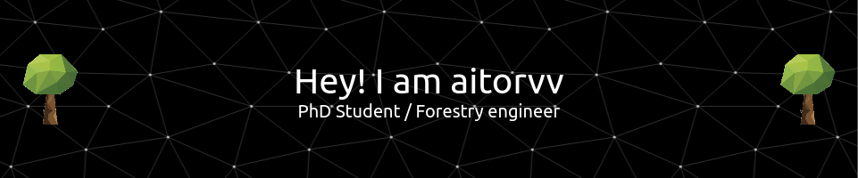

<!---  ---> 

# 🌲 Aitor Vázquez Veloso 🌳
### 🎓 PhD in Forest Engineering | 🔬 Postdoctoral Researcher at iuFOR | 💻 R & Python Developer

<!---  --->

---

I am a forest engineer and postdoctoral researcher at [iuFOR - University of Valladolid](https://portaldelaciencia.uva.es/investigadores/178830/detalle). My research combines forest inventory data, statistical modeling, and programming to simulate how ecosystems respond to management and environmental changes.

My main focus is translating complex mathematical growth and yield equations into interactive simulators and open-source packages. I want to make forest models accessible and usable for researchers, forest managers, and decision-makers. My work centers on forest modeling, forest management simulations and quantitative silviculture.

---

### 🏆 Featured Projects
- [SIMANFOR](https://github.com/simanfor) - Decision Support System (DSS) for simulating sustainable forest management, available on its [website](https://www.simanfor.es/).
- [silviculture](https://github.com/Cidree/silviculture) - An R package designed to process and analyze forest inventory data.
- [SMART Ecosystems Research Group](https://github.com/iuFOR-QuantitativeForestry) - Repositories from our research group at iuFOR.
- [SMART Global Ecosystems](https://github.com/SMART-Global-Ecosystems) - Code and resources for courses launched by the SMART Global Ecosystems Chair.
- :star: [My own repositories](https://github.com/aitorvv?tab=repositories) - Data, packages, and code from various personal and research projects.

<!--- 
 --->

---

### 📫 Contact Me

<!--- :sparkles: More about me:

 --->

<!--- aitorvv/aitorvv is a ✨ special ✨ repository because its `README.md` (this file) appears on your GitHub profile. You can click the Preview link to take a look at your changes. --->
